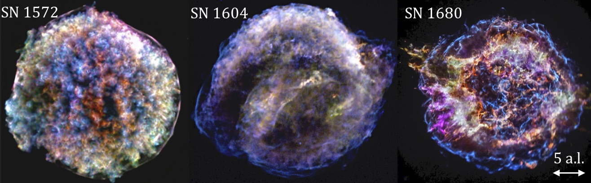

**Important News: PhD position with fundings from the French Space Agency [CNES](https://rt-theses.cnes.fr/?q=aas) and [AHEAD2020](http://ahead.iaps.inaf.it/) European project** 

A gallery of supernova remnants X-ray observations. The corresponding supernovae has been observed on Earth in the 16th and 17th century.
Red, yellow, green and orange colours indicate the spatial distribution of the ejected heavy elements.  
We propose to develop new tools to **build a 3D view of the ejecta map** based on  X-ray observations !  
The study will use existing observations from the Chandra X-ray telescope and synthetic Athena X-IFU observations.  
Athena is the X-ray observatory L-class mission selected by ESA to launch in early 2030s. Watch this nice X-IFU video [here](https://www.youtube.com/watch?v=mOf6WIDmi30).

## Internship/PhD subjects at CEA/Saclay: New multi-dimensional analysis methods for X-rays
For each photon the position, energy, and time of arrival is recorded by the X-ray satellite. Therefore X-ray data are multidimensional (X, Y, Energy, Time) by nature.  Here we propose to develop novel techniques to fully exploit the multidimensional nature of the data by combining blind source separation technique with feature learning [Bobin, Acero, Picquenot, 2019](https://ieeexplore.ieee.org/document/9022675/).
The internship will take place at the astronomy department (http://irfu.cea.fr/dap/) can start mid-march for 3-5 months. 

If you want to know more, read the full subject description here in english:  [PDF](Sujet-these-CNES-2021-AdvTools-EN.pdf).

## Proposition de sujets de recherche en 2021 au CEA/Saclay
Sujets de stage de Master 2 (3 à 5 mois) et de thèse sur l'étude des vestiges de supernova en rayons X disponible sur le [site de la SF2A](http://stages-masters.sf2a.eu/). 

Ce projet se propose de transformer la façon dont nous pouvons analyser les données en rayons X en se basant sur l’expertise acquise par le groupe de mathématiques appliquées au sein de notre laboratoire et en particulier sur les méthodes de séparation de sources (blind source separation) en exploitant le caractère multidimensionelle (RA, Dec, Energie) des données. Une nouveauté de notre approche est d'ajouter des contraintes physiques sur les résultats attendus. Ceci se fait via l'apprentissage à partir d'une librairie de spectres théoriques ([feature learning](https://en.wikipedia.org/wiki/Feature_learning)) qui facilitera la séparation des composantes physiques ayant des signatures spectrales distinctes.

Dans ce projet le/la candidat(e) utilisera ces nouveaux outils pour étudier quelles empreintes les mécanismes d’explosion de supernovae laissent dans leur vestiges. En effet les mécanismes des explosions de Type Ia ou d’effondrement gravitationnel sont encore mal connus mais comme chaque mécanisme laisse une empreinte spécifique dans les éjectas, l’étude de la morphologie en 3D des vestiges plusieurs centaines d’années après permet d’étudier l’explosion initiale.   
D’un point de vue technique, le/la candidat(e) aura pour but de développer et d’appliquer ces techniques étape par étape à des données de complexité croissante. Dans un premier temps cette application se fera aux données d’archives de XMM-Newton et XRISM (spectroscopie X haute résolution; lancement en 2022) et dans un second temps, à partir de simulations de vestiges de supernovae de simuler des observations Athena X-IFU à très haute résolution spectrale pour tester nos nouvelles méthodes.

Pour plus d'informations, lire la description du sujet de thèse ici ([PDF](Sujet-these-2021-AdvTools-FR.pdf)).

Pour postuler, envoyer votre CV par email (fabio.acero at cea fr).

## Références: 
Cosmic microwave background reconstruction from WMAP and Planck PR2 data; [Bobin et al., 2016](https://ui.adsabs.harvard.edu/abs/2016A%26A...591A..50B/abstract)  
Novel method for component separation of extended sources in X-ray astronomy; [Picquenot, Acero, Bobin, Maggi, Ballet & Pratt, 2019](https://ui.adsabs.harvard.edu/abs/2019A&A...627A.139P).
Metric Learning for Semi-Supervised Sparse Source Separation with Spectral Examples [Bobin, Acero, Picquenot, 2019](https://ieeexplore.ieee.org/document/9022675/)
